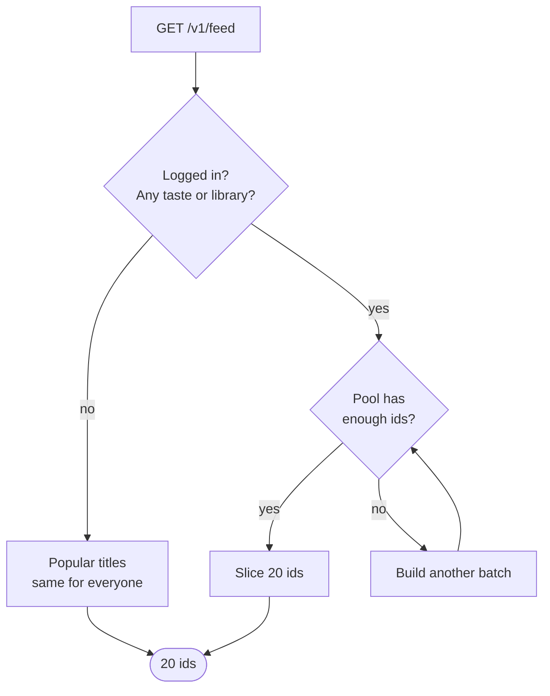

# How the feed works

Plain-English guide to what happens when someone opens the home screen. The
taste side is covered by `features/taste/how-taste-works.md` in the app repo.

## What the feed actually is

`GET /v1/feed` returns **a page of 20 TMDB ids** — nothing else. The app then
fetches the details for each id to draw the posters.

Behind that, the backend keeps a ranked **pool** of up to 500 ids per user per
media type, cached in Redis for 6 hours. Page 1 is the first 20 of the pool,
page 2 the next 20, and so on. When the pool runs short it's topped up.

## Who gets what

| Situation | What they get |
|---|---|
| Not logged in | Popular titles, cached for everyone, 1 hour |
| Logged in, no taste **and** empty library | Same popular titles |
| Logged in, has taste or library | Their own ranked pool |
| Pool ends up empty after filtering | Falls back to popular — the feed is never empty |

## Building one batch, step by step

Each batch is roughly 60–100 candidates in, ~60 ranked ids out.

### Step 1 — Build the profile

`ProfileBuilder` asks each contributor what it knows, then merges by summing
weights for the same id.

| Contributor | What it gives | Where it comes from |
|---|---|---|
| `TasteContributor` | The confirmed genres (weight 1) **and the picked title ids** | The taste wizard |
| `LibraryContributor` | Title ids with a like/dislike weight | Saves and star ratings |

Both put title ids into the same two lists, `knownMovieIds` and
`knownSeriesIds`. The weight decides who gets used first:

| Item | Weight |
|---|---|
| Rated 5★ | 1.0 |
| Saved | 0.5 |
| Rated 4★ | 0.5 |
| Seen, not rated | 0.3 |
| **Picked in the wizard** | **0.2** |
| Rated 3★ | 0 — ignored |
| Rated 1–2★ | negative — ignored as a source, still hidden from the feed |

Wizard picks sit below everything in the library on purpose: a save or a rating
is fresher evidence than a poster tapped during onboarding. Picking a film that
is also saved adds the two weights together, so it ranks a little higher.

### Step 2 — Fetch candidates from three sources

All three run at once, every batch.

| Source | What it asks TMDB | Notes |
|---|---|---|
| `taste` | Discover by the confirmed genres | One extra query per strong answer: classic/modern date window, grounded/escapist genre family, popular sort or a 7.4+ rating floor. 3 pages per batch. |
| `similar` | "What's like this?" for their 5 most-liked titles | **Only on the first batch**, so lookalikes cluster near the top. Library first, wizard picks after. |
| `popular` | Most popular titles | Always on, so the feed never becomes a bubble. |

Avoid chips are applied here already, as `without_genres` / `without_keywords`,
and "Very long commitment" caps film length. The commitment answer also sets a
runtime window: short = under 100 min, long = over 150 min. Series have no
runtime at this stage, so length only affects films.

For series, the movie genre ids from the wizard are translated to TV genre ids
(`movie-to-tv-genres.constant.ts`). Chips with no TV equivalent simply don't
narrow the search.

### Step 3 — Drop what shouldn't be there

Three hard filters. A candidate must pass all three.

| Filter | Drops |
|---|---|
| `AlreadyServed` | Anything shown to this user in the last 7 days |
| `ExcludeIds` | Anything in their library |
| `AvoidGenres` | Anything carrying an avoided genre — backstop for the popular and similar sources, which can't be filtered at the source |

### The avoid chips

The eight chips are not all genres. Each one maps to whatever TMDB actually
understands for that idea, and there are three kinds (`avoid.constant.ts`):

| Chip | Becomes | Kind |
|---|---|---|
| Horror | genre 27 (Horror) | genre |
| Reality TV | genre 10764 (Reality) | genre |
| War | genres 10752 (War) + 10768 (War & Politics) | genre |
| Kids content | genres 10751 (Family) + 10762 (Kids) | genre |
| Soap opera | genre 10766 (Soap) | genre |
| Gore | keyword 10292 | keyword |
| Anime | keyword 210024 | keyword |
| Very long commitment | films capped at 150 min | runtime |

Genres and keywords are TMDB's own two ways of labelling a title. A genre is one
of ~18 fixed buckets; a keyword is a free tag out of thousands. "Gore" and
"Anime" have no genre of their own, so they can only be blocked by tag.

Where each kind bites:

| Kind | Blocked at discover time | Blocked again after |
|---|---|---|
| Genre | `without_genres` | yes, by `AvoidGenres` |
| Keyword | `without_keywords` | **no** |
| Runtime | `with_runtime.lte` | no |

Three gaps worth knowing:

- **Keyword rules only work on the discover source.** TMDB's recommendation and
  popular responses don't carry keywords, so a gory or anime title can still
  reach the feed through those two. Genre rules don't have this problem — the
  `AvoidGenres` filter catches them everywhere.
- **"Horror" only blocks films.** TMDB has no Horror genre for TV, so horror
  series slip through.
- **"Very long commitment" only caps films.** Series carry no runtime at
  discover time.

Chips are stored as their English labels (`["Horror", "Gore"]`), and a stored
label that no longer exists is skipped, so renaming a chip silently drops
whatever users had picked.

### Step 4 — Score what's left

Every survivor gets a score: each scorer returns 0–1, multiplied by its weight,
all added up. The weights depend on the explore slider.

| Scorer | Gives a high score to | Weight at 0 "stick to what I love" | at 2 "balanced" | at 4 "surprise me" |
|---|---|---|---|---|
| `genreMatch` | Titles whose genres are mostly the user's genres | **1.30** | 0.95 | 0.60 |
| `quality` | High TMDB rating, backed by enough votes | 0.60 | 0.60 | 0.60 |
| `era` | Right side of the classic (≤1999) / modern (≥2015) line | 0.50 | 0.33 | 0.15 |
| `reality` | Grounded or escapist genres, whichever they chose | 0.50 | 0.33 | 0.15 |
| `authority` | Popular titles, or well-rated ones | 0.50 | 0.33 | 0.15 |
| `shuffle` | Nothing — a stable random number per title | 0.05 | 0.33 | **0.60** |

Answering "no preference" on a question makes that scorer return 0 for
everyone, so it stops mattering.

`shuffle` is what makes the "refresh" button work: it hashes the title id with a
seed, and refreshing rolls a new seed, so the same titles come back in a
different order.

### Step 5 — Mix the sources

Sources are ranked **separately** and never compete on raw score. Instead each
gets a share of the slots, and every slot goes to whichever source is furthest
behind its share.

Shares for a user with 10 or more liked titles:

| Explore level | taste | similar | popular |
|---|---|---|---|
| 0 — stick to what I love | 70% | 20% | 10% |
| 2 — balanced | 58% | 20% | 22% |
| 4 — surprise me | 45% | 20% | 35% |

The similar share scales with how many liked titles the user has — 5 gets half
of it, none gets nothing. Whatever similar can't claim goes back to taste. A
user straight out of the wizard has their 4–6 picks, so they get roughly 8–12%
lookalikes instead of none.

### Step 6 — Pool, pages, and cache

| Redis key | Holds | Lives for |
|---|---|---|
| `feed:{user}:{type}:pool` | The ranked ids | 6 hours |
| `feed:{user}:{type}:next-discover-page` | Which TMDB page to fetch next | 6 hours |
| `feed:{user}:{type}:shuffle-seed` | The current shuffle seed | 6 hours |
| `feed:{user}:{type}:served` | Everything already shown | 7 days |

Refresh clears the pool and re-rolls the seed but keeps `served`, so a refresh
reaches for genuinely new titles first. Saving taste clears all four keys, so
taste changes show up straight away. If filtering ever empties the pool
completely, `served` is cleared and paging restarts from TMDB page 1.

## Using the picked titles (added 2026-07-24)

The wizard asks for 4+ films the user loves. Those titles used to be turned into
genres and then thrown away — "I picked Interstellar" became "I like Sci-Fi",
and nothing else.

Now `TasteContributor` also returns them as title ids at weight 0.2, so they
feed the `similar` source alongside the library.

| Who | Before | After |
|---|---|---|
| Just finished the wizard, empty library | No lookalikes at all — genre discovery + popular only | Lookalikes of their picked films, roughly 10% of the feed |
| Active library (10+ items) | Lookalikes of their library | Same — library outranks wizard picks for all 5 slots |
| Picked a film that's also saved | Counted once, weight 0.5 | Counted once, weight 0.7 |

Two side effects worth knowing:

- The exclude list is built from the same two fields, so the films picked in the
  wizard no longer appear in the feed. That's intended — the user just said they
  know and like them.
- `getTasteForFeed` is cached for a day and now carries two more fields, so its
  Redis key changed from `taste-resolved-{user}` to `taste-for-feed-{user}`.
  Stale entries under the old key are simply never read again.

## Where things live

| What | File |
|---|---|
| Entry point, pool, paging, cache | `feed.service.ts` |
| Build one batch | `engine/engine.service.ts` |
| Ask TMDB for candidates | `engine/candidate-generator.ts` |
| The three filters | `engine/filters/` |
| The six scorers | `engine/scorers/` |
| **Who the user is** | `profile/profile.builder.ts` + `profile/contributors/` |
| All the tuning numbers | `feed.constants.ts` |
| Avoid chip → TMDB rule | `avoid.constant.ts` |
| Movie genre → TV genre | `movie-to-tv-genres.constant.ts` |
| Where taste comes from | `../taste/` and the app's `features/taste/how-taste-works.md` |
