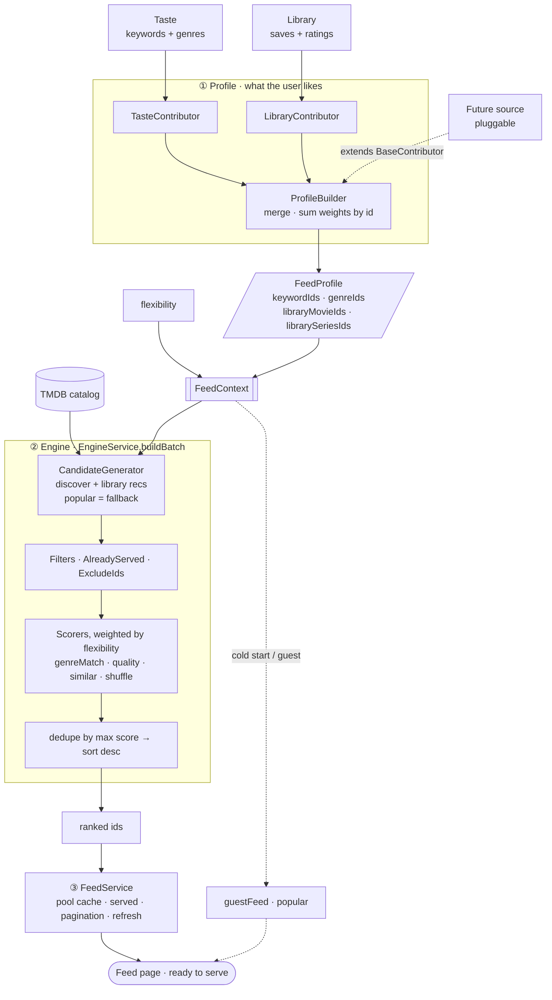

# Feed recommendation pipeline

## Stages

1. **Profile** — `ProfileBuilder` aggregates `BaseContributor`s (`TasteContributor`,
   `LibraryContributor`; future signals plug in by extending `BaseContributor`) into a
   `FeedProfile` of weighted ids. Media-agnostic, so it's cacheable per user.
2. **Engine** — `EngineService.buildBatch` turns a `FeedContext` (profile + flexibility +
   exclude/served + paging) into ranked ids: `CandidateGenerator` (taste discovery and
   library recommendations, popular as fallback) → filters → flexibility-weighted scorers
   → dedupe-by-max-score → sort.
3. **Service** — `FeedService` owns the cached pool, the served set, pagination, and
   refresh, and falls back to the public popular feed for guests and cold starts so a page
   is never empty.

`flexibility` is a ranking knob, not a taste signal: it lives on the `FeedContext` and
drives the scorer weights (`RANKING_WEIGHTS_BY_FLEXIBILITY`), not the profile.
