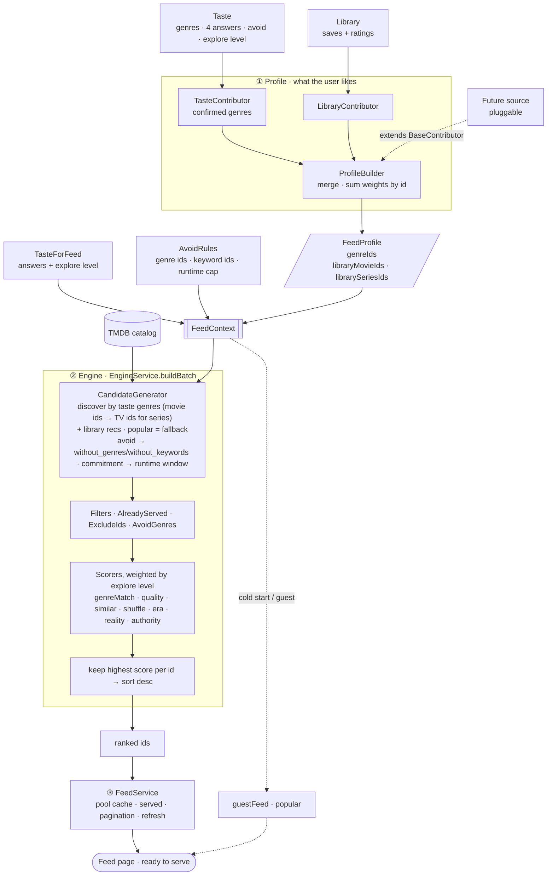

# Feed recommendation pipeline

## Stages

1. **Profile** — `ProfileBuilder` collects `BaseContributor`s (`TasteContributor`
   brings the confirmed taste genres, `LibraryContributor` the weighted library ids;
   future signals plug in by extending `BaseContributor`) into a `FeedProfile` of
   weighted ids. Media-agnostic, so it's cacheable per user.
2. **Engine** — `EngineService.buildBatch` turns a `FeedContext` (profile + taste +
   avoid rules + exclude/served + paging) into ranked ids: `CandidateGenerator`
   (taste discovery and library recommendations, popular as fallback) → filters →
   explore-level-weighted scorers → keep the highest score per id → sort.
3. **Service** — `FeedService` owns the cached pool, the served set, pagination, and
   refresh, and falls back to the public popular feed for guests and cold starts so a
   page is never empty.

## How taste drives the feed

- **Confirmed genres** feed both discovery (`with_genres`; movie genre ids are
  translated to their TV matches for series, see `movie-to-tv-genres.constant.ts`)
  and the `genreMatch` scorer.
- **The four answers** re-rank softly: `era` boosts titles on the chosen side of the
  classic/modern cutoffs, `reality` boosts grounded or escapist genre leans,
  `authority` boosts popularity (crowd) or rating (critic), and `commitment` sets a
  movie runtime window at discover time (series carry no length data there).
- **Avoid chips** are hard exclusions, applied twice: as `without_genres` /
  `without_keywords` at discover time, and by the `AvoidGenres` filter so the
  recommendation and popular sources can't sneak avoided genres back in. See
  `avoid.constant.ts` for the chip → TMDB mapping and its known gaps.
- **Explore level** (0 "Stick to what I love" … 4 "Surprise me") is a ranking knob,
  not a taste signal: it picks the scorer weights
  (`RANKING_WEIGHTS_BY_EXPLORE_LEVEL`) — low hugs the taste tightly, high loosens
  the match and raises the shuffle.
